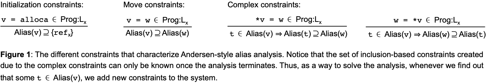

# Alias Analysis

We say that two pointers, p0 and p1, are aliases if they can point to the same memory location.
Alias analysis is a "may" static analysis that approximates the set of memory locations that each pointer can point to.
Thus, the goal of this analysis is to build a table, henceforth called an
*environment* that associates each pointer *p* with the memory locations that
*p* can point to.
The goal of this lab is to implement an Anderson-style points-to analysis, following the techniques seen in the [classroom](https://homepages.dcc.ufmg.br/~fernando/classes/dcc888/ementa/slides/PointerAnalysis.pdf).

## The Assignment

The goal of this lab is to finish the implementation of [alias.py](alias.py).
This file contains one method `abstract_interp`, which you must implement.
This method receives as input a list of instructions, and returns the environment of points-to information created by these instructions.
In addition to the instructions in our previous labs, we shall have to deal with four new kinds of instructions:

1. `v = alloca`: Creates a new memory location (called ir `r`), and makes `v` point to `r`.
2. `v = move w`: Moves the contents of `w` into `v`.
3. `*v = w`: Stores the contents of `w` into the memory location referenced by `v`.
4. `w = *v`: Loads the contents of the memory location references by `v` into `w`.

We shall be solving alias analysis using [Andersen's](http://www.cs.cornell.edu/courses/cs711/2005fa/papers/andersen-thesis94.pdf) approach.
Lars Ole Andersen solved alias analysis as a set of *Inclusion-Based* constraints such as `Alias(a) >= Alias(b)`, meaning that anything that `b` points to might also be pointed to by `a`.
See Section 2 of the [Wave Propagation Paper](https://homepages.dcc.ufmg.br/~fernando/publications/papers/CGO09.pdf) for more details on how the analysis works.
The different instructions in the program give origin to constraints like these.
However, alias analysis cannot be solved just like a simple data-flow analysis, because the set of constraints is not known beforehand.
More constraints are created as we discover more points-to relations.
Figure 1 shows how these constraints are created.



In Figure 1 we use the notation `Prog:Lx` to denote Line `x` of the program.
The line number is only important to name memory locations.
We call every memory location created at line `x` as `ref_x`.
So, to solve alias analysis we do as follows:

1. Process all the initialization constraints, to populate the environment (the Alias table in Figure 1) with points-to information.
2. Create a new set *G* of inclusion-based constraints with all the move instructions. Each move instruction such as `a = b` will add a constraint `Alias(a) >= Alias(b)` to *G*.
3. Repeat the following steps, until the alias sets stop changing:
    1. For each constraint `Alias(a) >= Alias(b)` in *G*, move all the points-to information from `Alias(b)` into `Alias(a)`.
    2. For each instruction `*v = w`, for each `t` in `Alias(v)`, add a new constraint `Alias(t) >= Alias(w)` to *G*.
    3. For each instruction `w = *v`, for each `t` in `Alias(v)`, add a new constraint `Alias(w) >= Alias(t)` to *G*.

Figure 2 below shows an example of how this algorithm works.


## Implementing the Assignment

You are free to implement function `abstract_interp` pretty much in any way you want.
However, to help you out, the function contains some comments explaining the steps that you must implement.
These steps have been organized into five functions, whose signature is given in the assignment.
These functions all come with doctests, which you can use to guide you throughout the implementation effort:

1. `Edge.eval`: the abstract evaluation of a constraint such as `Alias(a) >= Alias(b)`
2. `init_env`: the function that creates the initial alias table (called `env` in the assignment).
3. `propagate_alias_info`: the function that evaluates all the constraints such as `Alias(a) >= Alias(b)`.
4. `evaluate_st_constraints` and `evaluate_ld_constraints`: the functions that evaluate the complex constraints.

If you have implemented all these five functions, then you can organize them inside `abstract_interp`, following the comments within that function.

## Uploading the Assignment

Students enrolled in DCC888 have access to UFMG's grading system, via [Moodle](https://moodle.org/).
You must upload four python files to have your assignment graded: [driver.py](driver.py), [lang.py](lang.py), [parser.py](parser.py) and
[alias.py](alias.py).
Remember to click on "*Avaliar*" to have your assignment graded.

## Testing without Moodle

As in the previous labs, all the files in this exercise contain `doctest` comments.
You can easily test your implementation by doing, for instance:

```
python3 -m doctest alias.py
```

This lab also provides a [folder](tests) with some test cases.
To simulate automatic grading, you can run [drive.py](driver.py) directly, e.g.:

```
python3 driver.py < tests/ref0.txt
```

In this exercise, the driver prints the table of points-to information.
This lab also provides a [folder](tests) with some test cases.
To simulate automatic grading, you can run [drive.py](driver.py) directly, e.g.:

```
python3 driver.py < tests/ref0.txt
```

## Theoretical Questions

1. Figure 1 determines a dynamic constraint system: new constraints are created
whenever more information is bound to each alias table, due to the store
and load instructions. Then poinst-to information is propagated throughout the
new constraints. How do you know that this algorithm to solve the constraint
system ever terminates?

2. Figure 2.g shows an image of the heap, produced with a solution of the alias analysis. Each dashed line from `a` to `b` indicates that the pointer `a` can reference the memory location `b`. If such an edge exists, then is it the case that necessarily the address of `b` will ever be the value of `a`?

3. Let's take a look into the complement of Question 2 above: if the solution of the alias analysis does not determine a dashed edge from `a` to `b`, does it mean that there is no way, ever, that during the execution of the program, variable `a` can point to variable `b`?

4. The constraints such as `Alias(a) >= Alias(b)`, which are either created by `Move` instructions, or as a result of the evaluation of the complex constraints, determine a graph. Figures 2.c, 2.e and 2.f show instances of this points-to graph. A efficient way to solve a constraint system is to collapse cycles in this graph, unifying the points-to information of all the nodes in the strong component that was merged.
See Section 2 of the [Wave Propagation Paper](https://homepages.dcc.ufmg.br/~fernando/publications/papers/CGO09.pdf) for more details.
Why is it correct to merge nodes involved in a cycle?