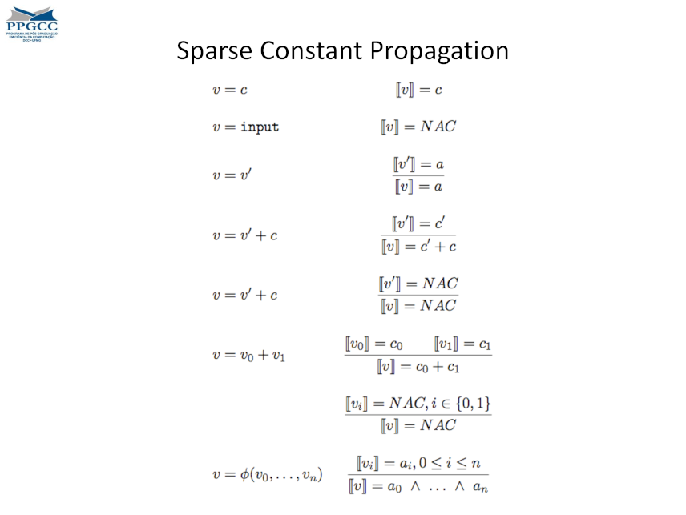
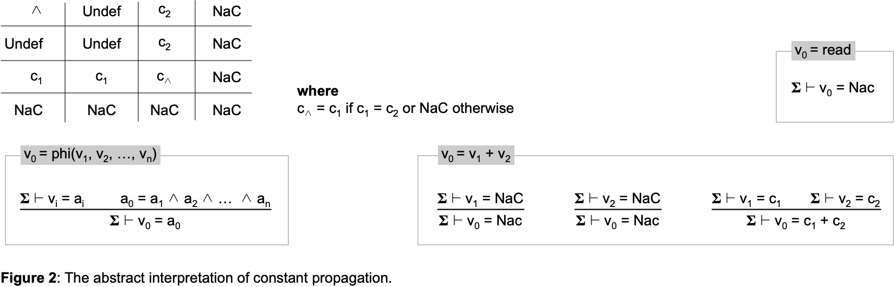
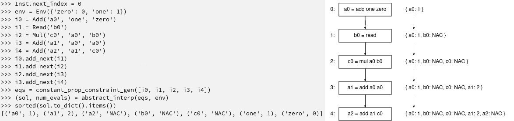

# Sparse Constant Propagation
Diffenrently from classical Dataflow Analysis, when dealing with SSA-Form programs we may utilize [sparse analysis](https://homepages.dcc.ufmg.br/~fernando/classes/dcc888/ementa/slides/SparseAbstractInterpretation.pdf). Since each variable is associated with a single state, the Dataflow result for each given variable depends only on its assigning instruction. Holding a global state for all program variables and updating it through each instruction is enough, and individual *IN* and *OUT* sets are no longer required.

One classical example of Sparse Analysis applicability is *constant propagation*. Each variable throughout the SSA-Form program may be a constant, not-a-constant or undefined.

- before assignment, all variables are undefined.
- constant variables are the result of operations with other constants
- not-a-constant (NAC) variables are the result of user input or operations including at least one NAC.

## The Assignment

In this lab we shall implement a sparse data-flow analysis for constant propagation.
Similarly to previous labs, a [parser implementation](../Parsing) is required.
Additionally, [phi functions](../PhiFunctions) are also required.
Thus, as a preliminary step, rename your parser, from that lab, from `todo.py` to `parser.py`. Next, copy the respective PhiFunction's `lang.py` into this lab.
The parser is the only file from the previous lab that you should reuse.

This lab requires implementing the `SparseConstantPropagation`'s `eval_aux` function. This function will hold all rules for this analysis.


> Observe that `abstract_interp` requires an `Env` parameter. This is due to the fact that this analysis must actually calculate operations among constants. This should be the same environment read from the original program - this is safe, the function operates over a copy of this object.

This analysis utilizes a fairly simple lattice:



Where every variable starts as "undefined". Observe that "meet" operations move variables sideways or up the lattice. In this exercise, variables will only appear as "undefined" if their operands are absent from the Env.

Since this analysis requires actually computing constant operations, it is useful to remember some features of an `Inst` object:
- `inst.uses() -> set[str]` returns the names of all variables being used in its operation.
- `inst.definition() -> set[str]` returns the names of all variables being assigned the operation's result.

## Uploading the Assignment

Students enrolled in DCC888 have access to UFMG's grading system, via [Moodle](https://moodle.org/).
You must upload four python files to have your assignment graded: [driver.py](driver.py), [lang.py](lang.py), [parser.py](parser.py) and
[dataflow.py](dataflow.py).
Remember to click on "*Avaliar*" to have your assignment graded.

## Testing without Moodle

As in the previous labs, all the files in this exercise contain `doctest` comments.
You can easily test your implementation by doing, for instance:

```
python3 -m doctest dataflow.py
```

As an example, the following program is included in the Doctests:



This lab also provides a [folder](tests) with some test cases.
To simulate automatic grading, you can run [drive.py](driver.py) directly, e.g.:

```
python3 driver.py < tests/fib.txt
```

In this exercise, the driver prints the dominance tree of each program.
