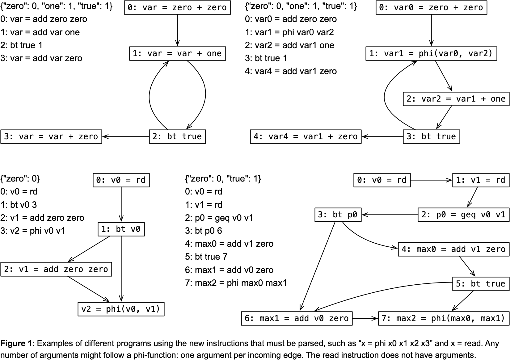
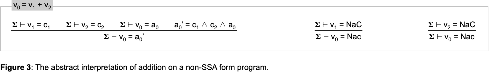

# Sparse Constant Propagation

[Constant propagation](https://en.wikipedia.org/wiki/Constant_folding) is a static program analysis technique used by compilers to determine whether the value of a variable is constant at each point in the program. If a variable always holds the same constant value during execution, this value can be folded directly into expressions that use the variable. This optimization, known as "constant folding", reduces runtime computations and can enable further optimizations like dead code elimination and strength reduction. Constant propagation typically works by tracking constant values through control flow paths using dataflow analysis.

The goal of this assignment is to implement a [sparse](https://homepages.dcc.ufmg.br/~fernando/classes/dcc888/ementa/slides/SparseAbstractInterpretation.pdf) version of constant propagation.
A sparse analysis associates information (e.g., constant or not) with the name of variables.
We get sparsity, at least in constant propagation, by running this analysis on [SSA-form programs](https://homepages.dcc.ufmg.br/~fernando/classes/dcc888/ementa/slides/StaticSingleAssignment.pdf).
Since each variable is associated with a single abstract state, the sparse analysis does not need to keep track of *IN* and *OUT* sets at each program point!
However, notice that in this exercise you must not assume that the program is in SSA form.
If such is not the case, your analysis must still terminate.
But it will be less precise: parts of a variable's live range that would be associated with constants will be marked as not-a-constant when the SSA-form property is missing.

## The Assignment

In this lab we shall implement a sparse data-flow analysis for constant propagation.
You will work with our [intermediate language](lang.py), which includes phi-functions, plus a new instruction `read`, which simulates program input.
But, this time, there is no need to interpret (at least concretely) programs in this language.
To complete this assignment, you will have to:

1. Finish the implementation of [parse.py](parse.py). You can start from our [first lab](../Parsing).
However, you will have to add to this new implementation the ability to read phi-functions and `read` instructions.
Figure 1 illustrate the new syntax.



2. Finish the implementation of our dataflow analysis.
The analysis is in [dataflow.py](dataflow.py).
Most of that file is already implemented.
Check the `TODO` comments to know where you must insert your interventions.
Figure 2 shows the abstract semantics of each instruction.


You will have to implement the evaluation of each kind of instruction we have (`add`, `mul`, `lth`, `geq`, `rd`, `bt` and `phi`). Additionally, you will have to define the meet operator of your lattice.
The lattice of constant propagation is rather simple.
And yet, even real-world compilers such as LLVM use this lattice.
For instance, you can check out LLVM's implementation of the meet operation on [ValueLattice](https://llvm.org/doxygen/ValueLattice_8h_source.html).
LLVM uses SSA-form; hence, meet is invoked on the [implementation of phi-functions](https://github.com/llvm/llvm-project/blob/839f52147c0cdbe7d4590cfdda089f250e5ec119/llvm/lib/Transforms/Utils/SCCPSolver.cpp#L1250C23-L1250C35).

## Uploading the Assignment

Students enrolled in DCC888 have access to UFMG's grading system, via [Moodle](https://moodle.org/).
You must upload four python files to have your assignment graded: [driver.py](driver.py), [lang.py](lang.py), [parser.py](parser.py) and
[dataflow.py](dataflow.py).
Remember to click on "*Avaliar*" to have your assignment graded.

## Testing without Moodle

As in the previous labs, all the files in this exercise contain `doctest` comments.
You can easily test your implementation by doing, for instance:

```
python3 -m doctest dataflow.py
```

## Theoretical Questions

1. If you process instructions in the order determined by the program's dominator tree, then, whenever you visit a non-phi instruction for the first time, all its operands are guaranteed to be bound to either a constant or to NAC, but not to UNDEF. Can you prove that this statement is true for well-formed programs where variables are always defined before being used?

2. If you process instructions in the order determined by the program's dominator tree, then, upon visiting a phi-function, it's possible that some of its arguments are bound to UNDEF. And yet, the algorithm works. Why?

3. If you process instructions in an SSA-form program in the order determined by the program's dominator tree, then, the meet operation only needs to be applied onto the arguments of phi-functions. You don't have to worry about performing meet on any other variable v: it suffices to interpret the instruction that creates v abstractly. Why does the meet operation happen only on phi-functions?

4. If the target program is not in SSA-form, then you need to apply the meet operator onto every variable, whenever you evaluate that variable, otherwise you risk non-termination. The abstract semantics would be a bit like the one described in this program below.
Can you explain why such is the case? Perhaps you can even show an example of a program where abstract interpretation would not terminate.

