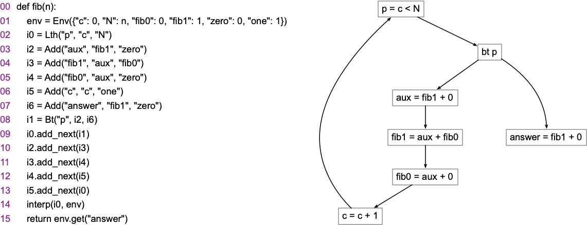

# Program Representations

The objective of this lab is to introduce students to simple ways to represent programs.
In particular, we shall be organizing [three-address code](https://en.wikipedia.org/wiki/Three-address_code) into a variation of a [control-flow graph](https://homepages.dcc.ufmg.br/~fernando/classes/dcc888/ementa/slides/ControlFlowGraphs.pdf).
Throughout this course, we shall be using a very simple programming language to implement some concepts learned [DCC888](https://homepages.dcc.ufmg.br/~fernando/classes/dcc888/).
This programming language contains, initially, five types of instructions:

* `Add(x, a, b)`: implements x = a + b
* `Mul(x, a, b)`: implements x = a * b
* `Lth(x, a, b)`: implements x = (a < b) ? 1 : 0
* `Geq(x, a, b)`: implements x = (a >= b) ? 1 : 0
* `Bt(x, i0, i1)`: if x != 0, then executes instruction i0, else executed i1

This programming language is very simple, but it is [Turing Complete](https://en.wikipedia.org/wiki/Turing_completeness): you can write any computable function using these instructions.
Every instruction has a *next* field, which is the next instruction that should be executed.
Branches (`Bt`), in turn, have two next fields (the two possible execution paths).
For instance, below there is an example of a program that computes Fibonacci Numbers:



An interpreter for this programming language is straightforward.
There is a prototype below:

```
def interp(instruction, environment):
    if instruction:
        instruction.eval(environment)
        return interp(instruction.get_next(), environment)
    else:
        return environment
```

The interpreter receives an instruction (which might have a `next` field), plus an environment.
The environment is a table that maps variable names (strings) to values (integers).
As an example, the code below should work in the Python REPL without raising an error:

```
env = Env({"m": 3, "n": 2, "zero": 0})
m_min = Add("answer", "m", "zero")
n_min = Add("answer", "n", "zero")
p = Lth("p", "n", "m")
b = Bt("p", n_min, m_min)
p.add_next(b)
assert(interp(p, env).get("answer") == 2)
```

## The Assignment

In this lab, you must implement three new functions, using the instructions in our programming language.
These functions are listed below:

* `test_min3(x, y, z)`: returns the minimum of x, y and z
* `test_div(m, n)`: returns the integer division of m by n.
* `test_fact(n)`: returns the factorial of n.


The lab contains a file, [todo.py](todo.py), which you must implement.
This file contains an example that you can use: the function `test_min`, which computes the minimum of two numbers.

## Uploading the Assignment

Students enrolled in DCC888 has access to UFMG's grading system, via [Moodle](https://moodle.org/).
See below how to upload your assignment.
The lab consists of three files: [todo.py](todo.py), [lang.py](lang.py) and [driver.py](driver.py).
You must upload these three files.
Once you upload these three files, remember to clique on "*Avaliar*" (evaluate), to make sure that you run the tests and get a grade!

## Testing without Moodle

In case you are not enrolled in DCC888, but still wants to try out the assignment, you can run it directly.
Except for [driver.py](driver.py), the other files use `doctests`, so that you can check that everything is correct doing:

```
python3 -m doctest lang.py # or python3 -m doctest todo.py
```

To simulate automatic grading, you can run `drive.py` directly, e.g.:

```
echo 1 > t.txt
python3 driver.py < t.txt
```
