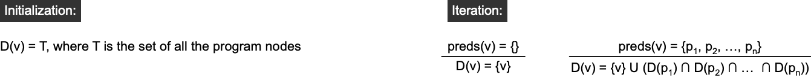
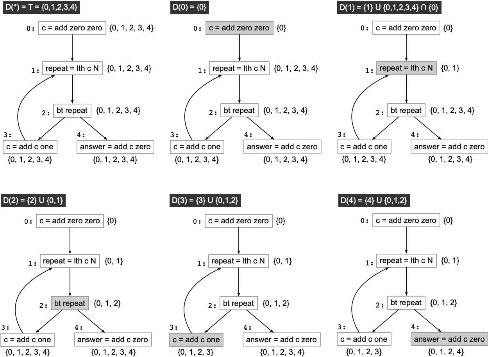
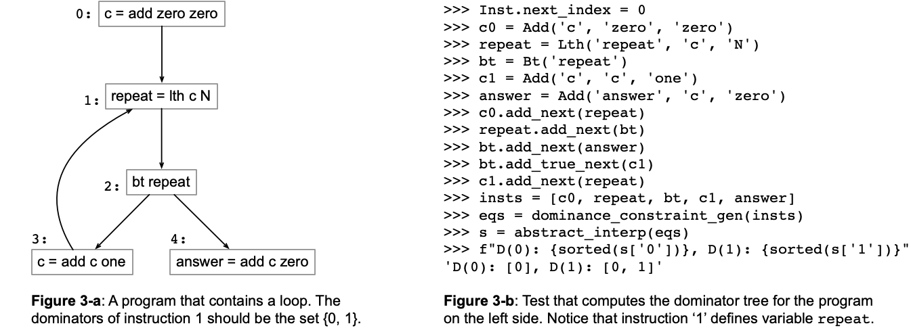

# Dominance

A node *d* of a control-flow graph dominates a node *n* if every path from the *entry* node to *n* must go through *d*.
The [theory of dominance](https://en.wikipedia.org/wiki/Dominator_(graph_theory)) is a key component of algorithms that discover loops in programs, as [explained in the classroom](https://homepages.dcc.ufmg.br/~fernando/classes/dcc888/ementa/slides/LoopOptimizations.pdf).
Dominance can be computed via a simple data-flow analysis, which Figure 1 illustrates.



In this lab, we shall implement these equations to compute the dominator tree of programs.

## The Assignment

In this lab we shall implement a data-flow analysis to compute dominators.
However, as in the [previous lab](../Worklist), to finish this exercise, you will have to have solved the [parsing exercise](../Parsing) (the lab about the implementation of the parser).
Thus, as a preliminary step, rename your parser, from that lab, from `todo.py` to `parser.py`.
The parser is the only file from the previous lab that you should reuse.

To solve this lab, we will have to implement three small code snippets:

1. First, finish the implementation of the class `Dominance_Eq`, which extends `DataFlowEq`, the same class that you have used in the [data-flow analyses lab](../IntroDataFlow).
2. Second, implement the function `dominance_constraint_gen`, which maps a list of instructions onto a list of dominance equations.
3. Finally, implement the function `abstract_interp`, which solves the set of dominance equations.

In contrast to the two data-flow analyses that we had seen in the previous labs ([Liveness](../IntroDataFlow) and [Reaching Definitions](../Worklist)), to solve dominance analysis you will have to initialize your data-flow facts with the top of the meet semilattice.
The top, in this case, is the set of all the program nodes.
Figure 2 explains why we must proceed in this way.
We are using intersection to implement the meet operator.
If we initialized every data-flow fact as the empty set, then the set of dominators of the `bt` node would always be empty (for the intersection of empty sets is an empty set!).



But, instead of collecting all the program nodes to implement this initialization, there is a cheap trick to simulate the top of the meet semilattice: use a universal set!
A universal set is a set whose intersection with any other set is the other set itself, e.g.: `set([1, 2, 3]) & UniversalSet() == {1, 2, 3}`.
If you use the ampersand operator (`&`) to perform intersection, then you can implement an universal set as follows:

```
class UniversalSet(set):
    def __and__(self, other):
        return other
    def __rand__(self, other):
        return other
```

## Uploading the Assignment

Students enrolled in DCC888 have access to UFMG's grading system, via [Moodle](https://moodle.org/).
You must upload four python files to have your assignment graded: [driver.py](driver.py), [lang.py](lang.py), [parser.py](parser.py) and
[dataflow.py](dataflow.py).
Remember to click on "*Avaliar*" to have your assignment graded.

## Testing without Moodle

As in the previous labs, all the files in this exercise contain `doctest` comments.
You can easily test your implementation by doing, for instance:

```
python3 -m doctest dataflow.py
```

As an example, the program in Figure 2 can be tested using the series of Python statements seen in Figure 3.



This lab also provides a [folder](tests) with some test cases.
To simulate automatic grading, you can run [drive.py](driver.py) directly, e.g.:

```
python3 driver.py < tests/fib.txt
```

In this exercise, the driver prints the dominance tree of each program.