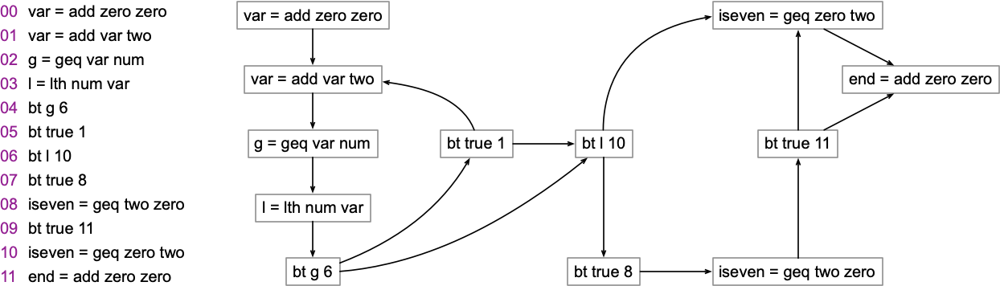

# Parsing

The objective of this lab is to implement a simple parser for our toy programming language.
This assignment shall be used in the next labs; hence, finish it before you move on!

## The Assignment

The goal of this lab is to convert a text file into a control-flow graph for our toy language.
As a recap, our toy language currently has five instructions (no worries: we shall be adding more instructions later on):

* `Add(x, a, b)`: implements x = a + b
* `Mul(x, a, b)`: implements x = a * b
* `Lth(x, a, b)`: implements x = (a < b) ? 1 : 0
* `Geq(x, a, b)`: implements x = (a >= b) ? 1 : 0
* `Bt(x, i0, i1)`: if x != 0, then executes instruction i0, else executed i1

You will have to read a text file and convert it to a program written in that language.
The language itself is implemented in [lang.py](lang.py), but you do not have to touch this file.
This text file has the following format:

* **First line**: A dictionary describing the environment
* **n-th line**: The n-th instruction in our program.

As an example, the program below sums up the numbers a, b and c:

```
{"a": 1, "b": 3, "c": 5}
x = add a b
l2 = x = add x c
```

To solve this lab, you will have to implement the function `file2cfg_and_env`. 
This function receives a list of strings, each representing a line of the text file, and then returns a pair, formed by an Environment (as defined in [lang.py](lang.py)), and a list of instructions.
Instructions are also defined in [lang.py](lang.py).
Your implementation must be done in the file [todo.py](todo.py).
The signature of `file2cfg_and_env` contains a doctest that will help you understand the input and the expected outputs.
Notice that branches have the following syntax:

```
bt cond offset
```

In this case, `cond` is the condition that is tested by the branch instruction, and `offset` is the index of the instruction to where we are branching.
We start counting from zero.
As an example, the program below will jump immediately to the last instruction. Thus, it will not change the value of x:

```
{"a": 1, "b": 3, "x": 42, "z": 0}
bt a 2
x = add a b
x = add x z
```

A program, of course, can have multiple branches.
The figure below provides a more complete example of how branches in the text file relate with branches in the target language:

The figure below provides a more complete example of how branches in the text file relate with branches in the target language:



## Uploading the Assignment

Students enrolled in DCC888 have access to UFMG's grading system, via [Moodle](https://moodle.org/).
You must upload three python files to have your assignment graded: [driver.py](driver.py), [lang.py](lang.py) and [todo.py](todo.py).
Remember to click on "*Avaliar*" to have your assignment graded.

## Testing without Moodle

In case you are not enrolled in DCC888, but still wants to try out the assignment, you can run it directly.
Except for [driver.py](driver.py), the other files use `doctests`, so that you can check that everything is correct doing:

```
python3 -m doctest lang.py
python3 -m doctest todo.py
```

This lab also provides a [folder](tests) with some test cases.
To simulate automatic grading, you can run [drive.py](driver.py) directly, e.g.:

```
python3 driver.py < tests/fib.txt
```
