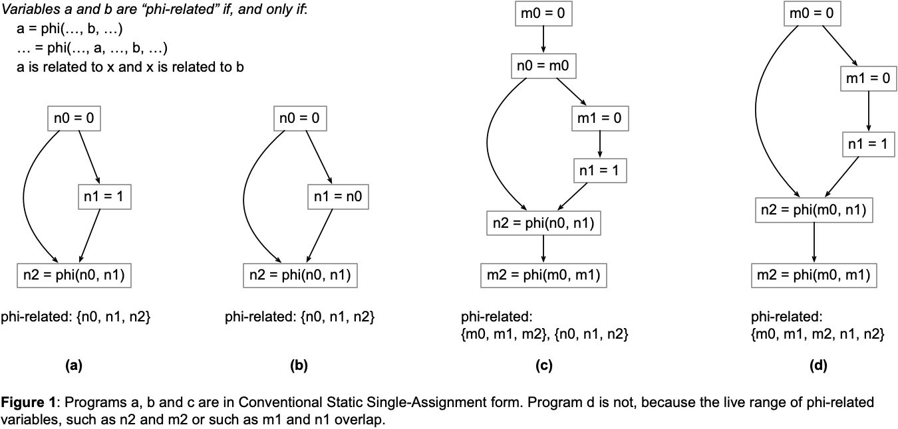
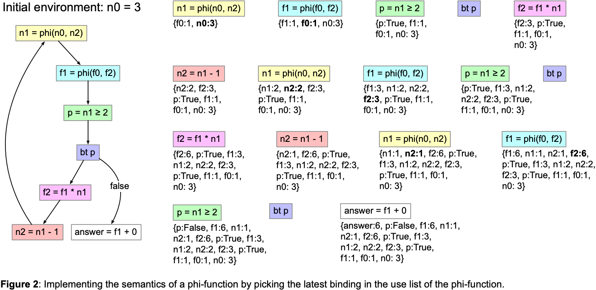
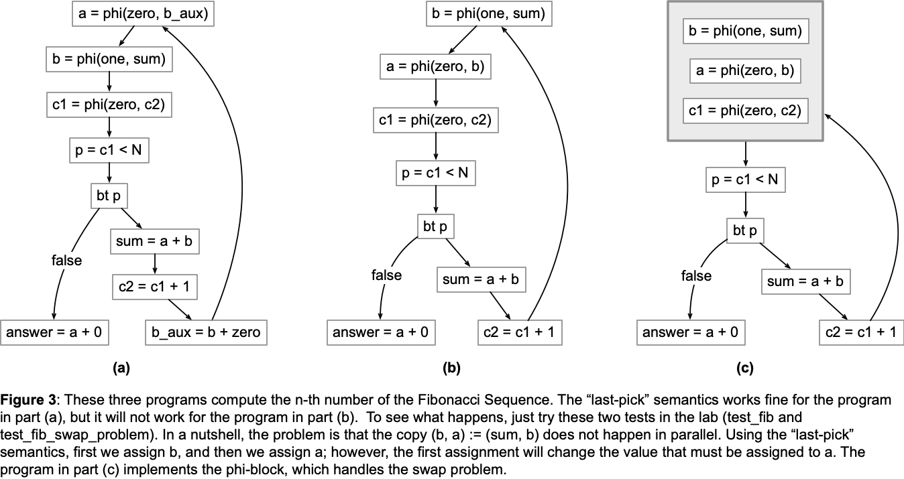
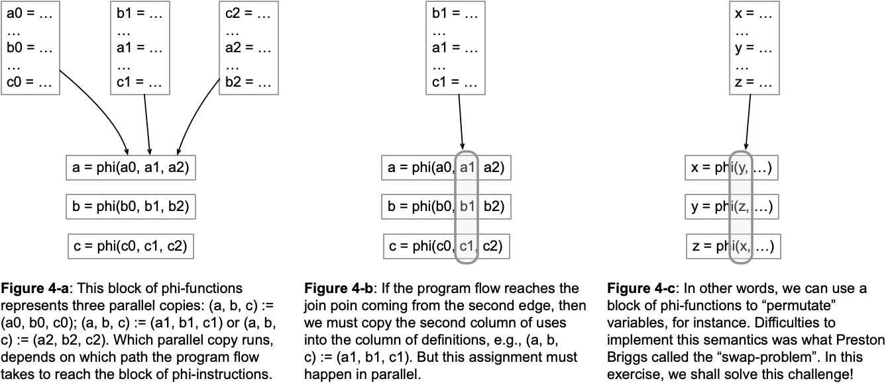

# Static Single-Assignment Form

[Static Single-Assignment](https://en.wikipedia.org/wiki/Static_single-assignment_form) (SSA) Form is a program representation similar to three-address code, but with a fundamental difference: each variable is assigned at only one program location.
SSA form programs enjoy an important property: the definition site of a variable dominates every use of that variable.
In practical terms, SSA is more of a notation than an actual program implementation; however, it is still possible to interpret these programs.
In this exercise, we shall do exactly this: write an interpreter for SSA-form programs.
We shall try two approaches: first, we will give some semantics to phi-functions, and then we will see that we, in fact, need more: to correctly implement the semantics of phi-functions, we need to evaluate them as parallel copies.
This lab refers to the class on static single-assignment form, which is part of the [material](https://homepages.dcc.ufmg.br/~fernando/classes/dcc888/ementa/slides/StaticSingleAssignment.pdf) covered in the classroom.

## The Assignment

This assignment has two parts.
In the first part, we shall implement a "tentative" semantics for phi-functions.
I say tentative because it will only work for a very special flavor of SSA-form programs: the so-called programs in *Conventional Static Single-Assignment (CSSA)
Form*.
In the second part, we shall implement the "correct" semantics of phi-functions, using a notion of 'phi-block'.
All these implementations must be done in [lang.py](lang.py).
This file has a few `TODO` comments that mark the places where interventions are expected.

### Conventional Static Single-Assignment Form

CSSA-form programs have the following definition, which we quote from the paper [SSA Elimination after Register Allocation](https://homepages.dcc.ufmg.br/~fernando/publications/papers/CC09.pdf): *A program is in CSSA form if no two variables related by phi-functions have overlapping live ranges*.
Figure 1 below explains the notion of phi-related variables with examples.



This tentative semantics for phi-functions will be implemented as follows:
given a phi-function such as `a0 = phi(a1, ..., an)`, we shall find, in the environment, the latest binding for any of the variables in the set `{a1, ..., an}`, and then assign this value to `a0`.
The class `Phi` is already implemented for you in [lang.py](lang.py).
Notice that this class invokes a method on the environment called `get_from_list`.
In this assignment, you will have to implement this method.
To help you understand how this semantics works, take a look into Figure 2 below:



This "pick-last" semantics will work fine for CSSA-form programs.
And it is rather elegant: we do not need to keep track of the path used to reach a phi-function: the last binding within its list of uses will be always the correct assignment (want to know why? Remember that the definition of a variable dominates its uses in an SSA-form program!).

### The Swap Problem

However, the pick-last semantics will collapse for non-CSSA form programs.
And these programs do exist.
Most algorithms that convert a program to SSA form will in fact create CSSA-form programs.
However, some compiler optimizations might propagate copies, breaking the conventional property.
That is what happened in Figure 1-d.
In this case, we start having issues like the infamous "*swap problem*" and the "*lost-copy problem*" which Preston Briggs described in the early days of [SSA design](https://homes.luddy.indiana.edu/achauhan/Teaching/B629/2006-Fall/CourseMaterial/1998-spe-briggs-ssa_improv.pdf).
Figure 3 illustrates the swap problem.



Thus, to correctly implement the semantics of phi-functions, all the phi-functions at some join point in a program must be evaluated together in two steps:

1. We read the variables in the incoming path that leads to the phi-functions.
2. We assign the variables that are defined by the phi-functions.

Figure 4 illustrates how this semantics works:



In the second part of this lab, we shall implement the correct semantics of Phi-Functions.
To this effect, you must finish the implementation of the class `PhiBlock`.
A phi-block groups a number of phi-functions as a matrix.
Once a phi-block is evaluated, all the values in a given column of this matrix are read and saved, and then the definitions are updated --- all in parallel.
To see a more detailed explanation of this semantics, please, refer to Section 3 of the paper '[SSA Elimination after Register Allocation](https://homepages.dcc.ufmg.br/~fernando/publications/papers/CC09.pdf)'.
Most of the implementation of the `PhiBlock` class is done for you; there will
be only three small parts that you need to complete.
Additionally, there is one small change that must be performed in [lang.py](lang.py): you must update the `interp` function, so that it passes the identifier of the last instruction to a phi-block.
The phi-block will use this identifier as a selector to choose the right parallel assignment to implement.
The [doctests](https://docs.python.org/3/library/doctest.html) will guide you through this process through interactive examples.

## Uploading the Assignment

Students enrolled in DCC888 have access to UFMG's grading system, via [Moodle](https://moodle.org/).
You must upload three python files to have your assignment graded: [driver.py](driver.py), [lang.py](lang.py), and [program.py](program.py).
Remember to click on "*Avaliar*" to have your assignment graded.

## Testing without Moodle

As in the previous labs, all the files in this exercise contain `doctest` comments.
You can easily test your implementation by doing, for instance:

```
python3 -m doctest lang.py
```

This lab also provides a [folder](tests) with some test cases.
To simulate automatic grading, you can run [drive.py](driver.py) directly, e.g.:

```
python3 driver.py < tests/fib0.txt
```

In this exercise, the driver runs particular programs (implemented using our three-address SSA-form language) with the inputs in the text file.

## Further Reading

Static-Single Assignment form exists since the late eighties.
One of the most well-known papers on this subject is [Cytron's](https://dl.acm.org/doi/10.1145/115372.115320).
That paper introduces the [algorithm that we saw in the classroom](https://homepages.dcc.ufmg.br/~fernando/classes/dcc888/ementa/slides/StaticSingleAssignment.pdf) to insert phi-functions in the program.
However, today, compilers usually use [Sreedhar's Algorithm](https://dl.acm.org/doi/10.1145/199448.199464) instead.
In fact, it was [Sreedhar](https://link.springer.com/chapter/10.1007/3-540-48294-6_13) and his colleagues that introduced the notion of Conventional Static Single-Assignment form.
The "Conventional" property would often emerge in the context of register allocation: a way to remove phi-functions is to allocate all the phi-related variables to the same register.
But if these variables have overlapping live ranges...
The [paper](https://homepages.dcc.ufmg.br/~fernando/publications/papers/CC09.pdf) that we quote in this lab to explain CSSA form exists exactly in this context: it shows how to allocate the same register or memory location to all the variables in a phi-function; that's how to do "SSA Elimination after Register Allocation".
