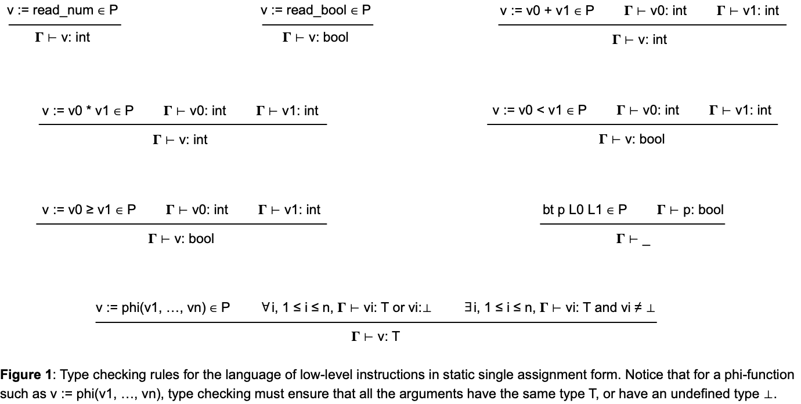

# Type Checking

If a language's syntax supports Type rules, the program can be type-checked to avoid [**stuck states**](https://homepages.dcc.ufmg.br/~fernando/classes/dcc888/ementa/slides/TypeSystems.pdf). **Stuck states** happen when a program must execute an operation with incompatible data, here seen as an instruction with incorrect types. Similarly to semantic rules, a program may be interpreted according to the type rules. If the program does not encounter a **stuck state**, it is sound, or **Safe**. A type-safe program has guaranteed *Progress* and *Preservation*.

- *Progress* implies that no instruction gets stuck: they can always be evaluated.
- *Preservation* implies that the program always progresses from a type-safe state to a type-safe state.

In this assignment, you shall implement a simple type check engine.
If a program passes type checking, then this program is guaranteed to run without reaching a stuck state.
Mind it that you will be implementing type checking, not [type inference](https://homepages.dcc.ufmg.br/~fernando/classes/dcc888/ementa/slides/TypeInference.pdf).
Type checking and type inference are two important concepts in programming languages, particularly in the context of statically typed languages.
Type checking is the process of verifying and enforcing the constraints of types—ensuring that the operations in a program are being performed on data types that are allowed for those operations.
Type inference is the process by which a compiler automatically deduces the types of expressions without explicit type annotations provided by the programmer.

## Pre-Requisites

In order to pass every test in this assignment you are expected to have solved the [Phi-Function](../PhiFunctions/) lab and the [Parsing](../Parsing) lab.
Make sure your parser exists in a file called `parser.py`.

## The Assignment

In this lab we must build a simple type-checker in the model language. In order to do this, a new set of features has been implemented onto [lang.py](lang.py):

- A new `TypeEnv` class extends the `Env` class and is used for type-checking.
- A new `InstTypeErr` exception to be raised when a given program has a type-invalid instruction
- The `Read` instruction has been split into the typed instructions ReadNum and ReadBool
- All instructions (`Add`, `Mul`, `Lth`, `Geq`, `Bt`, `Phi`, `PhiBlock`, `ReadNum`, `ReadBool`) have a `type_eval` method.
- A new global `type_check` function was added to [lang.py](lang.py).

In order to implement the type-checker, all `type_eval` methods must be implemented.
If an instruction fails to type check, then an `InstTypeErr` exception must be raised.
Type checking happens at the `type_check` function, which is already implemented for you.
This function iterates over the list of instructions and, by using `type_eval`, verifies if the whole program is sound.
The implementation of `type_eval` follows the type checking rules in Figure 1.



## Uploading the Assignment

Students enrolled in DCC888 have access to UFMG's grading system, via [Moodle](https://moodle.org/).
You must upload three python files to have your assignment graded: [driver.py](driver.py), [lang.py](lang.py) and [parser.py](parser.py)
Remember to click on "*Avaliar*" to have your assignment graded.

## Testing without Moodle

As in the previous labs, all the files in this exercise contain `doctest` comments.
You can easily test your implementation by doing, for instance:

```
python3 -m doctest lang.py
```

This lab also provides a [folder](tests) with some test cases.
To simulate automatic grading, you can run [drive.py](driver.py) directly, e.g.:

```
python3 driver.py < tests/fib.txt
```

## Theoretical Questions

1. The implementation of `type_check` evaluates all the instructions once, except phi-functions.
On a strict-SSA form program, if we evaluate instructions on the order defined by the program's [dominator tree](https://homepages.dcc.ufmg.br/~fernando/classes/dcc888/ementa/slides/LoopOptimizations.pdf), then we are guaranteed to have evaluated all the uses of an instruction *I* upon having to evaluate *I*, provided that *I* is not a phi-function.
Proof that this statement is true.

2. The statement of Question 1 is not valid for phi-functions.
However, we can come up with a version of it that should be valid:
"On a strict-SSA form program, if we evaluate instructions on the order defined by the program's [dominator tree](https://homepages.dcc.ufmg.br/~fernando/classes/dcc888/ementa/slides/LoopOptimizations.pdf), then we are guaranteed to have evaluated at least one of the arguments of a phi-function".
Can you demonstrate that the above statement is true?

3. Use the statement from Question 1 to demonstrate that once you call `type_eval` on an instruction *I* that is not a phi-function, then you will be able to either find a well-defined type for *I*, or raise a type error.

4. Use the statement from Question 2 to demonstrate that once you call `type_eval` on an instruction *I* that is a phi-function, then you will be able to either find a well-defined type for *I*, or raise a type error.

5. The `type_eval` function works in two steps: first, it evaluates all the
instructions in the list of instructions that form the program, e.g.:
```
if isinstance(inst, PhiBlock) or isinstance(inst, Phi):
  phi_queue.append(inst)
inst.type_eval(tp_env)
type_check(inst.get_next(), tp_env)
```
In a second phase, it evaluates all the phi-functions stored in the queue of
pending instructions, e.g.:
```
for phi in phi_queue:
  phi.type_eval(tp_env)
```
On this second phase, `type_eval` is guaranteed to only find a type environment
that associates a type with every variable name.
In other words, when we invoke `type_eval` upon a phi function, we know, for 
sure, that every argument of that phi function will have a type in the type
environment `tp_env` (it cannot be undefined).
Prove that the above statement is true.

6. Our type checking analysis associates each variable name with a single type.
Provide an argument demonstrating that for our toy language, the [static single-assignment](https://homepages.dcc.ufmg.br/~fernando/classes/dcc888/ementa/slides/StaticSingleAssignment.pdf) form is enough to ensure that this property -- single type per name -- holds.

7. Show an example of a program where you could get multiple types associated with the same name, were you not in the SSA format.

8. We are doing type checking, not type inference. Thus, a initial collection of
variables must be annotated with types, or else types must be inferred somehow.
For instance, in C, the programmer annotates variables with types such as
`int`, `double` or `struct Person`, for instance.
What is the syntactic constructs that add type annotations to our toy language?