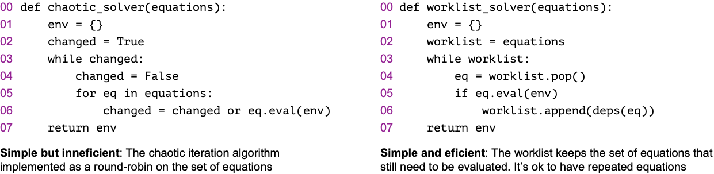
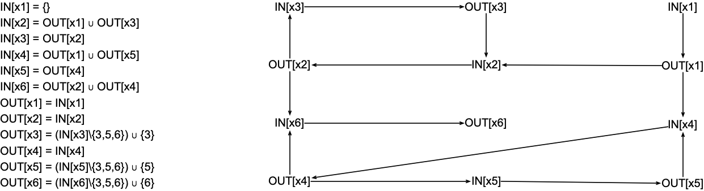

# Worklist-based Algorithms

In our last [lab](../IntroDataFlow) we had an introduction about the
[data-flow framework](https://homepages.dcc.ufmg.br/~fernando/classes/dcc888/ementa/slides/IntroDataFlow.pdf).
In that lab, we were solving data-flow equations via a technique called [chaotic iterations](https://youtu.be/z1ksufuIwcY?feature=shared).
The Chaotic Iteration method is rather slow.
In other words, one could do much faster using various different techniques,
which are the subject of our class on [algorithms to solve data-flow
equations](https://homepages.dcc.ufmg.br/~fernando/classes/dcc888/ementa/slides/WorkList.pdf).
In this lab, we shall implement one of these techniques: we shall use a worklist
to reduce the number of times we evaluate each equation of our data-flow
system.
The figure below illustrates how the new approach, based on a worklist, differs
from our original implementation of the data-flow solver:



## The Assignment

In this lab we shall implement a worklist-based solver, and shall use it to solve the reaching-definitions analysis.
Do not worry about implementing the evaluation of the reaching-definitions equations: that has already been done for you.
However, to finish this lab, you will have to have solved the [parsing exercise](../Parsing) (the lab about the implementation of the parser).
Thus, as a preliminary step, rename your parser, from that lab, from `todo.py` to `parser.py`.
Notice that this lab contains a file [parser.py](parser.py), which you can replace with the `todo.py` from that previous lab (well, assuming that you have implemented it, of course).
The parser is the only file from the previous lab that you should reuse.

**Dependencies**: The goal of this lab is to implement the worklist-based solver.
This solver uses a notion of "*dependencies*" between equations.
We say that an equation *e0* depends on an equation *e1* if the right-hand side of *e0* uses the variable that *e1* defines.
In this lab, the equations have a `deps` property that return the list of their
dependencies.
This special property is implement for all the equations, except for
`ReachingDefs_IN_Eq`.
Your first task is to implement this property.

**The dependence graph**:
Once you have implemented all the pending `deps` properties (well, there is only one to be implemented, really), you must use them to build a *dependence graph*.
A dependence graph is a data structure that maps equations equations to lists of equations.
If *G* is a dependence graph, and *e* is an equation, then *G[e]* is the list of all the equations that use *e*.
In this exercise, we are mapping equations by name, e.g., we write
`deps[eq.name()]`, instead of `deps[eq]`.
The function that builds the dependence graph is `build_dependence_graph`.
This function receives a list of equations, and returns the dependence graph
formed by these equations.
You must implement this function.
An example of a system of data-flow equations, and the corresponding dependence graph can be seen in the figure below.



**The solver**:
To finish this lab, you must use your dependence graph to implement a worklist-
based solver (function `worklist_solver` in [dataflow.py](dataflow.py)), following the design in Figure 1-b.
Basically, if the evaluation of an equation *e* changes the environment, you must push back onto the worklist only the other equations that depend on *e*.
Iterations happen by popping the first equation in the worklist, and evaluating it, until eventually the worklist becomes empty.
Notice that the worklist will become necessarily empty, as our system of equations that solve reaching definitions is guaranteed to reach a [fixed point](https://homepages.dcc.ufmg.br/~fernando/classes/dcc888/ementa/slides/Lattices.pdf).

## Uploading the Assignment

Students enrolled in DCC888 have access to UFMG's grading system, via [Moodle](https://moodle.org/).
You must upload four python files to have your assignment graded: [driver.py](driver.py), [lang.py](lang.py), [parser.py](parser.py) and
[dataflow.py](dataflow.py).
Remember to click on "*Avaliar*" to have your assignment graded.

## Testing without Moodle

As in the previous labs, all the files in this exercise contain `doctest` comments.
You can easily test your implementation by doing, for instance:

```
python3 -m doctest dataflow.py
```

This lab also provides a [folder](tests) with some test cases.
To simulate automatic grading, you can run [drive.py](driver.py) directly, e.g.:

```
python3 driver.py < tests/fib.txt
```

In this lab, the driver invokes two solvers onto the same system of equations.
The first solver, our baseline, is the `chaotic_solver` that we have seen in the [previous lab](../IntroDataFlow/).
The second solver, `worklist_solver`, is the worklist-based algorithm that you must implement in this exercise.
The driver then does two things:

1. It checks for correctness, verifying if both solvers produce the same final environment.
2. It checks for efficiency, verifying if the `worklist_solver` evaluates less equations than `chaotic_solver`.

Notice that to implement step (2) above, our current implementation tracks the number of times that each method `eval` was invoked upon an equation, via a class attribute `DataFlowEq.num_evals`.